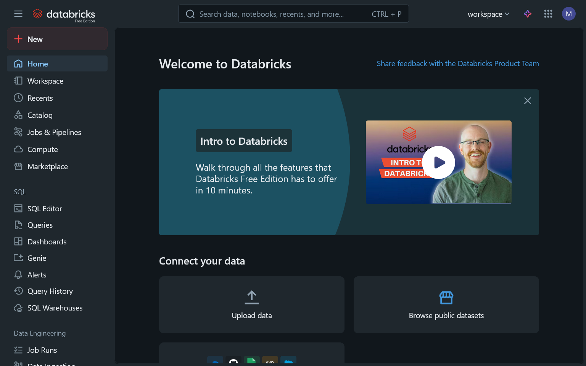
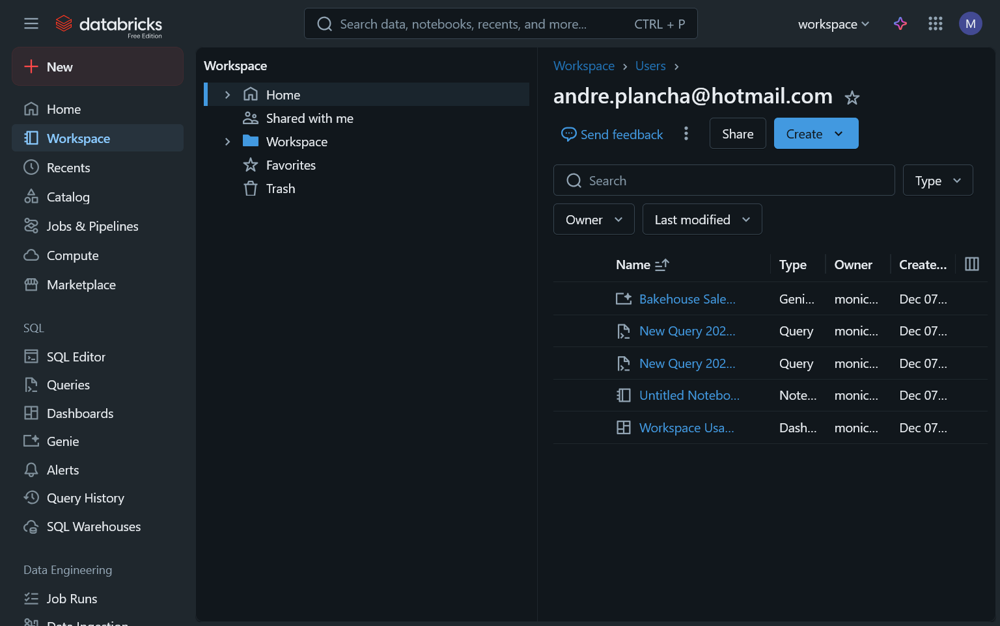
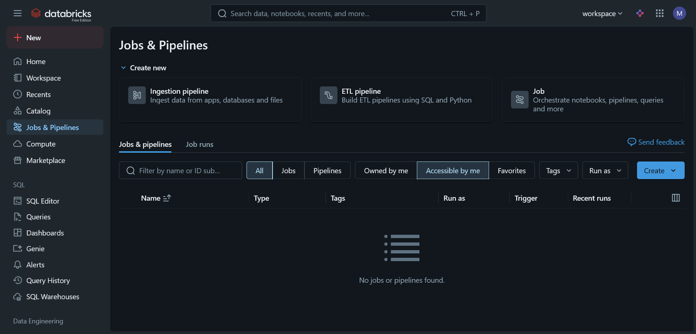
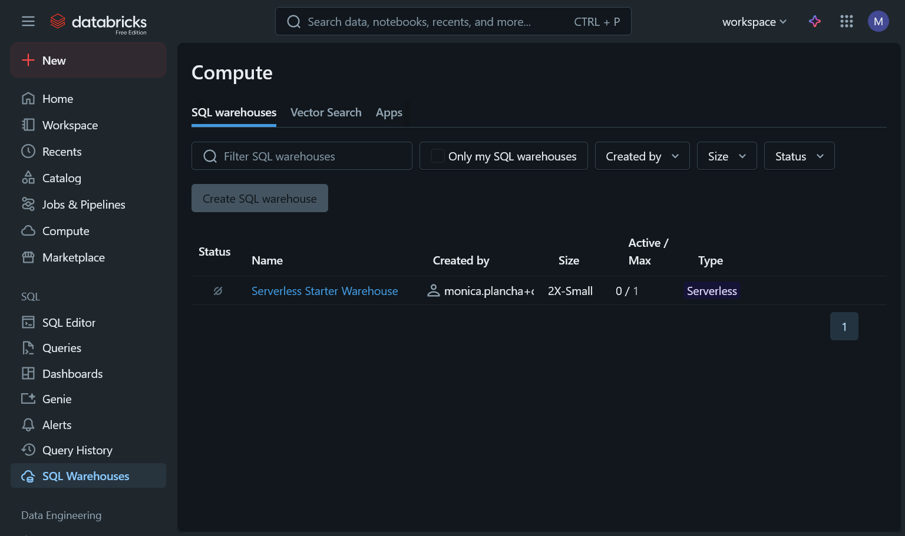

1. Home​
The Home page serves as the main landing page with a welcoming interface. It features an "Intro to Databricks" video tutorial that walks through features in 10 minutes. The page includes a "Connect your data" section with options to upload data, browse public datasets, and connect to 50+ data sources (showing logos for Cloud, GitHub, Google Sheets, AWS, and Salesforce). There are also sections for taking courses (SQL & Analytics, Data Engineering, and Generative AI) and exploring starter projects like learning notebooks, conversational analytics, and building GenAI chatbots.

2. Workspace​
The Workspace acts as a file management system for Databricks projects. It displays a hierarchical navigation with folders like Home, Shared with me, Workspace, Favorites, and Trash. The main area shows a table listing various assets including a Genie space called "Bakehouse Sales Starter Space," queries, notebooks, and dashboards. Each item displays its type, owner (andre.plancha@hotmail.com), and creation date (all from Dec 07, 2025). The interface includes search functionality, filtering options by owner and last modified date, and a "Create" button for new assets.

3. Catalog​
The Catalog page is the data discovery and management interface. It shows a left sidebar with catalog organization including "My organization" section with workspace and system catalogs, plus a "Delta Shares Received" section with samples. The main panel displays "Quick access" tabs for Recents, Favorites, and Catalogs, showing recently accessed items like the "workspace" catalog. The interface includes a Serverless Starter Warehouse selector (2XS size), Delta Sharing options, External Data access, and Governed Tags controls for data governance.

4. Jobs & Pipelines​
This page is dedicated to workflow orchestration and data pipeline management. At the top, there's a "Create new" section with three options: Ingestion pipeline (for ingesting data from apps, databases, and files), ETL pipeline (for building ETL pipelines using SQL and Python), and Job (for orchestrating notebooks, pipelines, queries, and more). The main area shows a jobs list with filters for All/Jobs/Pipelines and ownership options, but currently displays "No jobs or pipelines found," indicating this is a fresh workspace.

5. Compute​
The Compute page manages computational resources with three tabs: SQL warehouses, Vector Search, and Apps. In the SQL warehouses tab (currently active), there's one resource listed: "Serverless Starter Warehouse" with status shown as active, size 2X-Small, configured for 1/1 active/max connections, and type Serverless. The page includes filtering options by name, owner, size, and status, plus a disabled "Create SQL warehouse" button, suggesting resource limitations in the free edition.

